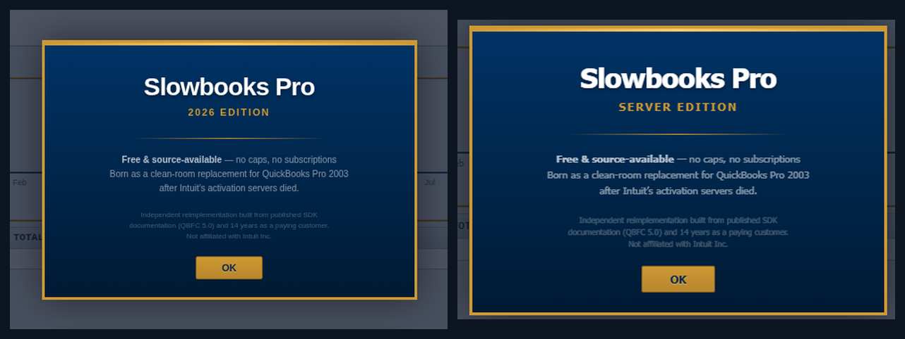
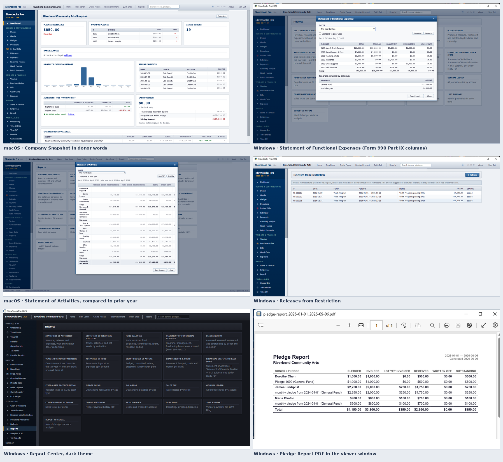
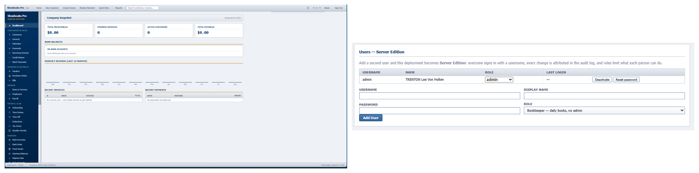
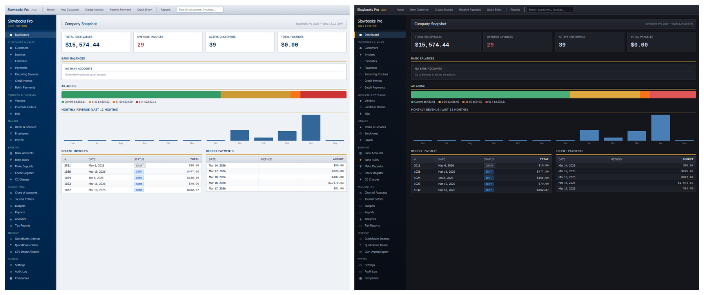
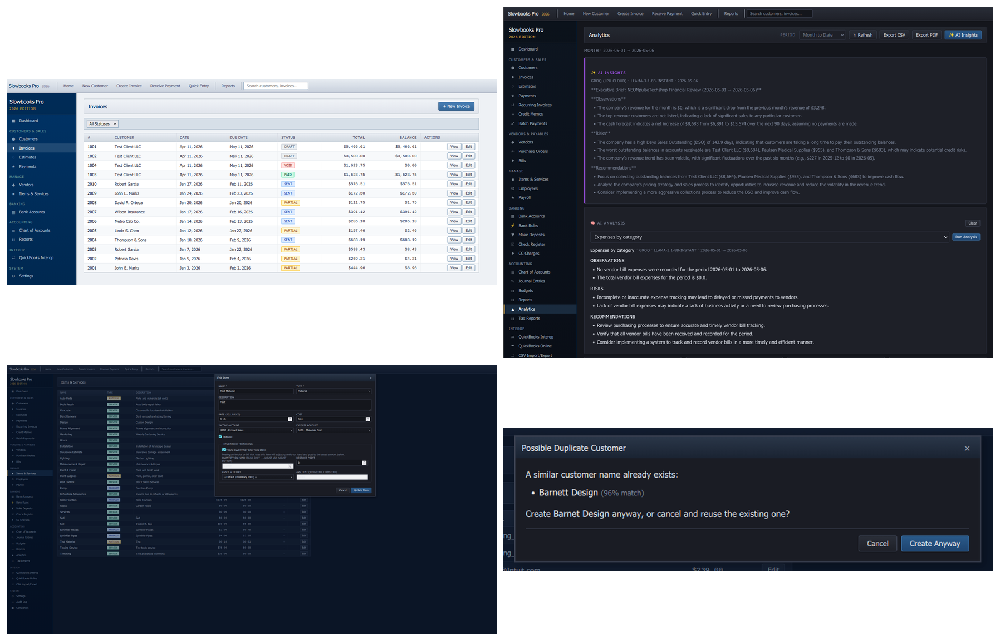

# Slowbooks Pro 2026

**A personal bookkeeping application raised from the ashes of QuickBooks 2003 Pro.**

Free, source-available, and complete: double-entry accounting, unlimited
invoicing, US payroll with tamper-evident tax forms, perpetual inventory,
bank feeds, analytics — with every record in local files you control. No
cloud, no account, no telemetry, no caps, no paid tiers. **Multi-user
Server Edition is built into the same signed installer — no Docker
required** (Docker remains an optional path for Linux servers).

**Get started:**
[Windows installer](https://github.com/VonHoltenCodes/SlowBooks-Pro-2026/releases/latest/download/SlowBooksPro-Setup-x64.exe) ·
[macOS DMG](https://github.com/VonHoltenCodes/SlowBooks-Pro-2026/releases/latest/download/SlowBooksPro-macos-arm64.dmg) ·
[Docker / Linux](#quick-start) ·
[slowbookspro.com](https://www.slowbookspro.com)



*One free product, two shapes: your desktop — or the whole office from one PC.*

---

## The Story

I ran QuickBooks 2003 Pro for 14 years for side-business invoicing and
bookkeeping. Then the hard drive died. Intuit's activation servers have
been dead since ~2017, so the software can't be reinstalled. The license
I paid for is worthless.

So I built my own replacement, and transferred my data out of the old
.QBW file using IIF export/import. Early versions wore the grief openly —
the code was annotated with invented "decompilation" comments referencing
`QBW32.EXE` offsets and Btrieve table layouts as a tribute to software
that served me well until its maker decided it should stop working. The
codebase has since grown up; the last of those comments came out in
v2.14.0, and the fiction now lives only in this origin story. The
software never depended on it.

**This is an independent, from-scratch reimplementation.** No Intuit
source code or binaries were available, decompiled, or used.

---

## Accessibility

SlowBooks Pro strives to conform to WCAG 2.1 AA: labelled controls,
real dialogs, live notifications, and contrast improvements in both themes.
PDF generation requests PDF/UA-1 tagging; accessibility verification is ongoing.
Details, known gaps and how to report a barrier:
[docs/accessibility.md](docs/accessibility.md) and
[the accessibility page](https://www.slowbookspro.com/accessibility/).

## What's New

**v2.19 — Type to find it.** The pickers search as you type, as QuickBooks'
do: a customer, vendor, item, account, employee, job or class picker, or any
long list, narrows to what matches ("6500" finds 6500 Rent or Lease), and
"+ New Customer" opens its quick add with the name you typed. Screen readers
hear the picker's name, the number of matches and the highlighted one.

**v2.18 — Around the ledger.** Two of the QA agents each ran a brand-new
company for a day through the screens and checked every figure against the
ledger; this release fixes all sixty-eight things they found around it.
Pay Sales Tax works, supplier tax is part of a purchase's cost instead of
reducing the tax owed, Schedule C keeps expenses in expenses, customer and
vendor balances show what is owed, a customer's leftover payment can be
applied later, and every aging report ties to the balance sheet. Time
tracking works end to end, tax forms open in the Mac app, foreign-currency
invoices can be paid from the screen, and backups are kept and restored per
company. It also brings @Sciumo's QuickBooks Online import of journal
entries and posted ledger activity, with a live import log (#192), a switch
for the company logo on invoices, and **Fetch older history** for SimpleFIN
bank feeds — up to a year where the provider keeps it (#181). Tax rates take
four decimal places (8.875%), and the payment screens see every open invoice
and bill, not just the newest 500 (#191). Each company now keeps its logo,
attachments and employee documents in its own company file: companies on
one desktop shared them, and a server published them without a sign-in.
2.18.1 imports QuickBooks names without the quote marks QuickBooks puts
around a name with a comma, offers to bring ALL-CAPS names in as normal
capitalization (#195, @TheLocalW), imports the lines QuickBooks posts to a
sub-account, and keeps the permit form's format note off its boxes (#194,
@cnbarry1). 2.18.2 gives every form field a name a screen reader can say
(#198), says so when an import comes back with errors (#197), and lists
Claude and Grok first among the AI providers, with Claude on Sonnet 5.5
(#200).

**v2.17 — Your ledger, in a spreadsheet.** Trial Balance and General Ledger
save as a CSV and a printable PDF, and Profit & Loss and Balance Sheet gain
the CSV — amounts as plain numbers, ready to sum. The general ledger carries
a balance brought forward, a running balance and a period total that ties to
the trial balance. Bank feeds accept a setup token from any SimpleFIN
provider. Asked for by @cnbarry1 (#179, #181). 2.17.1 makes AI analysis
work again with OpenAI's current models (#185, @Sciumo); 2.17.2 stops an
invoice edit from stripping its job costing (#187, @Bit-Sage); 2.17.3 makes
Pay Bills pay each vendor separately and keeps every payment on its own
customer's or vendor's documents (#189, @Bit-Sage).

**v2.16 — The year at a glance.** Two new overview cards, both opt-in under
Customize: **P&L: Year to Date** with cumulative net by month, and a
**Balance Sheet Trend** over the last twelve month-ends that balances at
every point and agrees with the report. Contributed by @jarvis4openclaw
(#166). The chart of accounts import offers a CSV template. 2.16.1 fixes
Wave's full export importing no journals after a passing dry run (#169);
2.16.2 stops charging tax to non-taxable customers, widens every money
column for large-denomination currencies (#173), and puts the estimate and
job-cost forms right (#174, #176); 2.16.3 lets a fresh Docker image start again.

**v2.15 — Your chart, from your file.** Import a chart of accounts from a
CSV in the export's columns, any spreadsheet with Number / Name / Type, or
hledger's account list. A dry run shows every row's fate first; existing and
control accounts are renamed in place, never duplicated. Asked for by
@tresero (#139, #161).

**Branch updates after upstream 2.19.0 — unreleased** (upstream 2.19.0 is merged; the work below is not yet in the installer downloads):

- **Payroll and HR:** expanded contractor runs, schedules, locations, retro pay,
  benefits and workers' comp; employee portal time submission, corrected deposit
  calendars, bank-holiday/blackout handling, and reliable save refreshes.
- **Accounting integrity:** fix lost balances under concurrent journal writes,
  guard repeated processing/reversals, prevent document-audit chain forks, and
  commit signatures together with their audit records.
- **Security and operations:** stronger session checks, private uploads, PII
  redaction and signed audit checkpoints; hardened Docker/server defaults,
  preserved encryption keys, and verified backup/restore and migration paths.
- **Performance:** bounded transaction lists and fewer database queries; a
  synthetic 50,000-invoice/150,000-line workload completed 192 page reads without
  errors. This is a bounded test, not enterprise capacity certification.

**Continued beta validation — October 5, 2026:** 6,547 passed, 12
documented conditional skips, zero failures; 96.92% statement coverage
with SQLite, PostgreSQL 17, native OCR and all 47 Chromium cases passing.
The rebuilt beta passed stale payroll-cap handling, exact draft cancellation,
ordinary taxable employer contributions and retro-pay boundary checks. Actual
image checks passed backup recovery across all 101 tables, strict HTTPS,
native OCR and Kubernetes deployment. Alembic head: `b7fringe2026105`.
The [current beta checklist](docs/beta-continuation-2026-10-05.md) records exact
source/image hashes, final results, evidence and remaining gates. The
[first beta audit](docs/beta-readiness-2026-10-05.md) retains its broader
accounting, nonprofit and frontend observations, including 85 Node tests,
11 live workflows and 154 axe audit occurrences, with their original build
provenance. Earlier snapshots remain in [validation history](docs/validation.md).

**Still required before public release:** unsupported special fringe and
historical payroll reconciliation; state/local classification verification;
supporting release-image updates; signed native-platform and live-provider
acceptance; human accessibility, deployment capacity and independent security
review; hosted CI/code-owner review and author signoffs.
Existing installs should follow the
[concurrency-fix upgrade checks](docs/operations.md#concurrency-fix-upgrade-checks);
these fixes do not repair historical balance drift or audit-chain damage.
Feature details: [payroll/HR guide](docs/payroll-hr-module.md).

**v2.9 — Nonprofit mode.** One switch in Settings and a church, a club, a
PTO or a community arts group sees its own words — donors, pledges,
donations, funds, grants — and gets the documents every treasurer and
auditor asks for: net assets by restriction with a release-from-restriction
document, the Statement of Activities and Statement of Financial Position,
fund balances, a Statement of Functional Expenses fed by allocation rules
that split rent and wages across program / management / fundraising, donor
acknowledgments with the IRS language, in-kind gifts, pledge tracking with
write-offs, and year-end giving statements. Everything reconciles to the
P&L and balance sheet to the cent. Guide:
[docs/nonprofit-module.md](docs/nonprofit-module.md).



**v2.7 — Jobs, job costing, and receipt intake.** QuickBooks-style
Customer:Job on every form and every posted line, nested cost codes with
cost types and burden, Job Cost Entries for labor / equipment / mileage /
overhead, time posted to jobs at loaded rates, budgets seeded from
estimates, and a job page that drills from cost type to code to the
posted line with Budget / Committed / Actual / Projected / Variance — the
columns contractors already read. QuickBooks `Customer:Job` and Online
sub-customers import as jobs. Plus **receipt intake**: scan a receipt
photo or PDF into a Bill, Expense or Sales Receipt with a box-to-fix
canvas, using the OCR engine built into macOS and Windows (Tesseract on
Linux). Design notes: [docs/design/projects.md](docs/design/projects.md).

**v2.6 — Sales receipts.** Point-of-sale style sales on one screen: the
sale and its payment recorded together, deposited where you say, posted
atomically — and kept on their own page so they don't clutter your
invoices. Your existing receipt history imports too: `CASH SALE` blocks
from QuickBooks Desktop IIF files and the SalesReceipt entity over the
QuickBooks Online connection, with a migration guide covering both paths
([docs/migrate-from-quickbooks.md](docs/migrate-from-quickbooks.md)).
Built because a user asked for it.

**v2.5 — Server Edition.** The same signed installer can serve your whole
office from one Windows PC: users with roles (admin / bookkeeper /
read-only), username logins, per-user audit attribution, and a startup
task that has the books serving before anyone logs in — everyone else
just needs a browser. An edition is a state, not a SKU: add a second user
and you've promoted yourself, free either way. Field-verified on real
office hardware before release. See
**[docs/server-edition.md](docs/server-edition.md)**.

v2.5 also debuts the **signed & notarized Apple Silicon macOS app**
(maintained by [@ContractorKeith](https://github.com/ContractorKeith)) —
a native `.app` in a DMG, no Docker or Python required.



**v2.4 — Bank feeds & the AI-ready API.** Automatic transaction sync via
[SimpleFIN](https://www.simplefin.org/) — you hold the bank credential,
no middleman server, dedup + bank rules on arrival
([docs/setup-bank-feeds.md](docs/setup-bank-feeds.md)). Every install
also serves a self-documenting local REST API (617 operations in this branch); point
Claude Code or any agentic CLI at it —
[slowbookspro.com/ai](https://www.slowbookspro.com/ai/) has the
paste-prompt.

**v2.3 — Migrate from anywhere.** One Migrate Data page for Xero, MYOB,
Sage 50, Wave, Zoho Books, and GnuCash — every import dry-run-verified
against your trial balance before a single record is written, with
opening balances posted automatically.

Full history in **[CHANGELOG.md](CHANGELOG.md)**.

---

## Wait — it does *that*?

**Cryptographically tamper-evident tax forms.** Every W-2, W-3, 940, and
941 PDF carries a SHA-256 content hash and audit ID printed in the
footer. An auditor can recompute the hash and confirm the form hasn't
been edited since generation, against the local `document_audits` chain.
Not a watermark — a verification trail.

**Bring-your-own-AI, including your own gateway.** AI Insights runs
against any of eight providers (xAI Grok, Groq, Cloudflare Workers AI,
Anthropic Claude, OpenAI, Google Gemini, a Cloudflare Worker you host
yourself, or a public-HTTPS OpenAI-compatible Chat Completions endpoint) — keys encrypted at rest with versioned, rotatable ciphertext.
See [provider setup and compatibility limits](docs/ai-providers.md).
And the whole app is agent-operable through its local API: see the
[AI setup guide](https://www.slowbookspro.com/ai/).

**One-click reseller-permit verification.** Per-state format validation
(WA/CA/TX), one click opens the state's official lookup, and the
who-and-when verification trail lands on the customer record.

**Boots refuse to lie to you.** Dev and debug containers run the
frontend↔backend wiring audit *before* uvicorn binds the port — drift
between the JS and the routes fails the boot instead of 404-ing
mid-feature. Release images gate on the same check in CI.

---

## What it does

Full catalog in **[docs/features.md](docs/features.md)**. Highlights:

- **Accounts receivable** — invoices, estimates, payments with
  multi-invoice allocation, credit memos, recurring schedules, batch
  payments, Quick Entry for paper backlogs
- **Accounts payable** — purchase orders, bills, bill payments, vendor
  credits, AP aging
- **Double-entry core** — auto + manual journals, closing-date
  enforcement, automatic audit log, 50-account contractor chart
- **Banking** — the register is the ledger (entries post, feeds are a review queue, reconciliation over ledger lines), transfers, deposits, check printing,
  OFX/QFX + Bank of America/Chase/PayPal CSV import with dedup, SimpleFIN bank feeds,
  shared auto-categorization rules
- **Reports & tax** — P&L (plain & by Class), Balance Sheet, Trial
  Balance, agings, GL, Cash Flow, Sales Tax with pay-to-government flow,
  Schedule C, printable PDF pack
- **Payroll & HR** — full US module with W-2/W-3/940/941, deductions,
  garnishments, PTO, onboarding, and a token-accessed employee portal
  ([docs/payroll-hr-module.md](docs/payroll-hr-module.md))
- **Inventory** — perpetual ledger, weighted-average cost, automatic
  COGS, reorder points
- **Analytics + AI** — 8 live metrics, 90-day cash forecast, optional
  BYOK insights
- **Server Edition** — users, roles, attributed audit trail, serves the
  office from one PC, built into the same signed installer
  ([docs/server-edition.md](docs/server-edition.md))
- **Bank feeds** — [SimpleFIN](https://www.simplefin.org/): you hold the
  bank credential, no middleman server
  ([docs/setup-bank-feeds.md](docs/setup-bank-feeds.md))
- **Jobs & job costing** — Customer:Job on every form, cost codes and
  types with burden, time posted at loaded rates, budget vs actual
- **Receipt intake** — scan a photo or PDF into a Bill, Expense or Sales
  Receipt with the OCR built into macOS and Windows (Tesseract on Linux)
- **Online payments** — [Stripe](docs/setup-stripe.md),
  [PayPal](docs/setup-paypal.md), [Square](docs/setup-square.md) behind
  one abstraction, desktop-mode recording included
- **Interop & migration** — QuickBooks IIF round-trip incl. sales
  receipts ([docs/migrate-from-quickbooks.md](docs/migrate-from-quickbooks.md)),
  [QBO OAuth sync](docs/setup-qbo.md), Migrate Data for Xero / MYOB /
  Sage 50 / Wave / Zoho Books / GnuCash, Opening Balances wizard
- **Fixed assets** — register, depreciation runs, disposal with
  gain/loss, reconciliation report
- **Nonprofit mode** — your own words on every screen and document; funds
  with restrictions, releases, functional expenses, donor acknowledgments,
  giving statements, pledges
  ([docs/nonprofit-module.md](docs/nonprofit-module.md))
- **Accessibility** — AA contrast in both themes, tagged PDFs, working
  toward WCAG 2.1 AA ([docs/accessibility.md](docs/accessibility.md))
- **Duplicate detection** — fuzzy customer/vendor matching at create time



*Both themes ship in the box — toggle from the topbar or `Alt+D`; the choice persists.*




*Server Edition: an edition is a state, not a SKU — add a second user and you've promoted yourself, free either way.*

---

## Quick Start

### Windows — signed installer

Download **[SlowBooksPro-Setup-x64.exe](https://github.com/VonHoltenCodes/SlowBooks-Pro-2026/releases/latest/download/SlowBooksPro-Setup-x64.exe)**
and double-click. Fully self-contained (64-bit Windows 10/11); a portable
.zip is on the [releases page](https://github.com/VonHoltenCodes/SlowBooks-Pro-2026/releases/latest)
— it needs the Microsoft Edge WebView2 runtime, which Windows 11 has and the
installer sets up; without it the app offers to open in your browser instead.
Each company is one SQLite file under `%LOCALAPPDATA%\SlowBooksPro` —
upgrades and even uninstalls never touch your books.

**Serve the office (Server Edition):** on the host PC, run the bundled
`serveredition-install.ps1` from an elevated PowerShell — firewall,
startup task, and machine-wide data location handled. Details in
[docs/server-edition.md](docs/server-edition.md).

### macOS — signed Apple Silicon app

Download **[SlowBooksPro-macos-arm64.dmg](https://github.com/VonHoltenCodes/SlowBooks-Pro-2026/releases/latest/download/SlowBooksPro-macos-arm64.dmg)**,
drag **SlowBooks Pro** to Applications, launch. Signed and notarized with
the project's Apple Developer ID on every release; macOS 14+, Apple
Silicon. Intel Macs: Docker.

### Docker (Linux servers, Intel Mac)

Docker is optional — multi-user LAN serving on Windows is **Server
Edition**, built into the signed installer above (no containers involved).
Docker remains the path for Linux servers and Intel Macs:

```bash
git clone https://github.com/VonHoltenCodes/SlowBooks-Pro-2026.git
cd SlowBooks-Pro-2026
cp .env.example .env
# Set PAYROLL_ENCRYPTION_SECRET and SESSION_SECRET_KEY in .env to separate
# values generated with: openssl rand -hex 32. Generate SETTINGS_ENCRYPTION_KEY
# with the Docker command documented in .env.example. Generate the audit signing
# key there too; keep all four stable.
# For this localhost-only Compose setup, set FORCE_HTTPS=false in .env.
# Keep BIND_ADDR=127.0.0.1; network-facing deployments require TLS.
docker compose up
```

Open **http://localhost:3001** — PostgreSQL, migrations, and seed data
are automatic. The image includes `tesseract-ocr` and `poppler-utils` so
receipt scanning works out of the box; native installs add them with
`sudo apt install tesseract-ocr poppler-utils` (optional — scanning
degrades gracefully when they're absent).

Native installs, demo data, troubleshooting: **[INSTALL.md](INSTALL.md)**.
Backups, restore, key rotation: **[docs/operations.md](docs/operations.md)**.
Production checklist: **[docs/release-checklist.md](docs/release-checklist.md)**.

---

## Documentation

Maintainers: [validation results and remaining release checks](docs/validation.md).

| Doc | Covers |
|-----|--------|
| [INSTALL.md](INSTALL.md) | Install / first-run / upgrade (installer + DMG + Docker + native) |
| [docs/server-edition.md](docs/server-edition.md) | Serving the office: setup, users & roles, troubleshooting |
| [packaging/macos/README.md](packaging/macos/README.md) | macOS maintainer build, signing, notarization runbook |
| [docs/features.md](docs/features.md) | Full feature catalog + API endpoint reference |
| [docs/development.md](docs/development.md) | Tech stack, project structure, contributor flow |
| [docs/data-model.md](docs/data-model.md) | Database schema |
| [docs/operations.md](docs/operations.md) | Backups, restore, key rotation, monitoring |
| [docs/payroll-hr-module.md](docs/payroll-hr-module.md) | Payroll / HR module reference |
| [docs/release-checklist.md](docs/release-checklist.md) | Production deployment checklist |
| [docs/tls-proxy-setup.md](docs/tls-proxy-setup.md) | Real certs in front of Slowbooks (Caddy, nginx, Traefik) |
| [docs/cloud-hosting.md](docs/cloud-hosting.md) | Your own books on a cloud server: VPS, Docker, Caddy, backups off the box, what it does and does not give you |
| [docs/security-hardening.md](docs/security-hardening.md) | Security pass — what changed, why, how it's tested |
| [docs/hipaa-compliance.md](docs/hipaa-compliance.md) | HIPAA mapping — honest gap list included |
| [docs/wiring-audit.md](docs/wiring-audit.md) | Frontend ↔ backend drift audit methodology |
| [docs/banking.md](docs/banking.md) | The register is the ledger: entries, feeds as a review queue, transfers, reconciliation |
| [docs/nonprofit-module.md](docs/nonprofit-module.md) | Nonprofit mode: funds, restrictions, functional expenses, donor documents |
| [docs/accessibility.md](docs/accessibility.md) | WCAG 2.1 AA conformance, known gaps, how to report a barrier |
| [docs/migrate-from-quickbooks.md](docs/migrate-from-quickbooks.md) | QuickBooks Desktop (IIF) and Online migration, sales receipts included |
| [docs/state-withholding.md](docs/state-withholding.md) | State income-tax withholding tables and their sources |
| [docs/setup-bank-feeds.md](docs/setup-bank-feeds.md) | SimpleFIN bank feeds |
| [docs/setup-qbo.md](docs/setup-qbo.md) · [Stripe](docs/setup-stripe.md) · [PayPal](docs/setup-paypal.md) · [Square](docs/setup-square.md) | Integrations |
| [docs/migrate-from-myob.md](docs/migrate-from-myob.md) | MYOB migration walkthrough |
| [SECURITY.md](SECURITY.md) · [CONTRIBUTING.md](CONTRIBUTING.md) · [CHANGELOG.md](CHANGELOG.md) | Policy, contributing, history |

---

## Tech Stack

Python + FastAPI on PostgreSQL (SQLite for tests and desktop companies,
one file each) with SQLAlchemy 2.0 and Alembic. Vanilla HTML/CSS/JS
single-page app — no framework, no build step. WeasyPrint + Jinja2 for
PDFs; self-hosted Chart.js (no CDN, LAN-deployable). Hosted-checkout
payments only — card data never touches the app. Port 3001.

The Windows and Apple Silicon desktop builds freeze the same codebase
with PyInstaller + pywebview. Both sign in CI on every release tag:
Windows via Azure Trusted Signing, macOS with the project's Apple
Developer ID — signed, notarized, and stapled on the runner (signing
credentials live only in repo secrets, never in the repo).

Full layout in [docs/development.md](docs/development.md).

---

## License

**Source-available. Free forever. Yours to self-host.** Use it for
yourself or your business, modify it, redistribute it, keep your clients'
books on it. Don't sell it, offer it as a paid service, or build it into
one, in whole or in part. Tools and connectors that talk to it are
welcome, commercial or not. Illinois law. The full terms, version 2.0,
are in [LICENSE](LICENSE); the app shows the short form once on first
launch and the Windows installer shows the whole thing. Contributions
come in under the Contributor Terms in [CONTRIBUTING.md](CONTRIBUTING.md).

---

## Acknowledgments

- 14 years of QuickBooks 2003 Pro (1 license, $199.95, 2003 dollars)
- Every small business owner who lost software they paid for when
  activation servers died

---

## Contributors

- [VonHoltenCodes](https://github.com/VonHoltenCodes) — creator and maintainer
- [Keith (@ContractorKeith)](https://github.com/ContractorKeith) — macOS testing and review

Maintainers by platform are in [CONTRIBUTING.md](CONTRIBUTING.md). Everyone
who has contributed is credited in the [CHANGELOG](CHANGELOG.md) entry that
shipped their work and in the git history.
