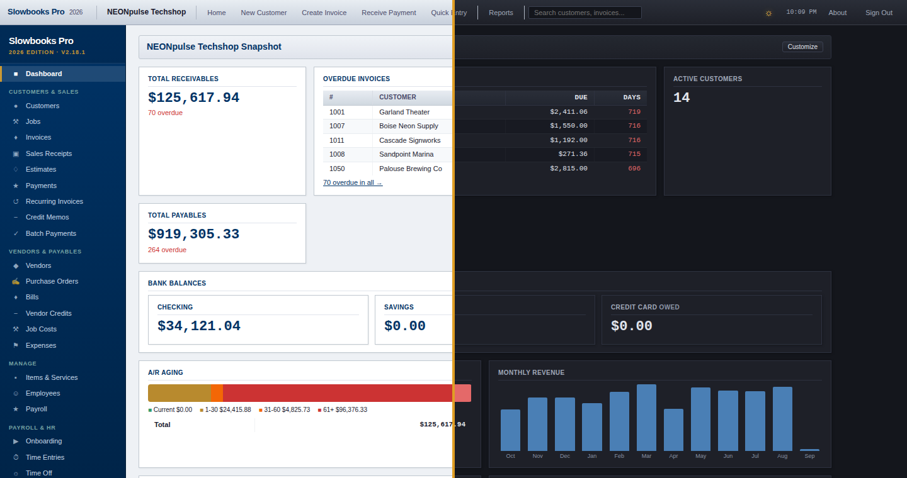

# Accessibility

SlowBooks Pro is built to be usable by everyone, including people who rely
on screen readers, keyboards, or high-contrast displays. We **strive to
conform to WCAG 2.1 Level AA**. We do not claim compliance — no certifying
body issues one — but we test against it, fix what we find, and treat a
barrier as a bug.

- Every data table declares its column headers (`scope="col"`).
- Icon-only buttons (remove a line, delete an attachment, close a dialog)
  carry accessible names.
- Notifications ("Invoice saved") announce through a polite live region.
- Dialogs are real dialogs: focus moves into them, Tab and Shift+Tab stay
  inside, Escape closes them, and focus returns to the control that opened
  them.
- State is never conveyed by colour alone (e.g. the reconciliation
  difference reads "Balanced" / "Out of balance").
- Muted text meets the 4.5:1 contrast ratio in both the light and dark
  themes.
- The shared PDF renderer requests PDF/UA-1 tagging. COBRA and state SUI
  reports also use that renderer. If tagged rendering fails, it falls back
  to an ordinary PDF; tagging and full PDF/UA conformance are not guaranteed.

## What we know is still open

- Full keyboard, screen-reader, and rendered contrast testing across workflows
  remains outstanding. Source checks and PDF structure checks are not a WCAG
  or PDF/UA conformance assessment. No browser was available for the 2026-09-07
  validation pass; see [validation results](validation.md).
- The chart-of-accounts tree and some long entry forms could use landmark
  regions and skip links.
- Colour-coding on the dashboard charts has text equivalents in the legend
  but not on the bars themselves.
- Keyboard-only drag ordering is not offered where a mouse drag exists
  (the dashboard uses arrow buttons instead).

## Tell us

If something in SlowBooks Pro is hard or impossible for you to use, open
an issue at https://github.com/VonHoltenCodes/SlowBooks-Pro-2026/issues or
email trent@neonpulsetechshop.com and say which screen and which assistive
technology. Barriers are triaged as bugs.

The same statement, with more screenshots, is on the website:
https://www.slowbookspro.com/accessibility/
